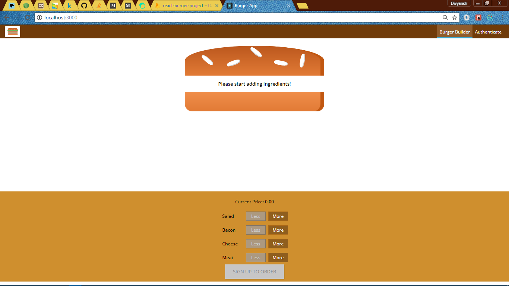
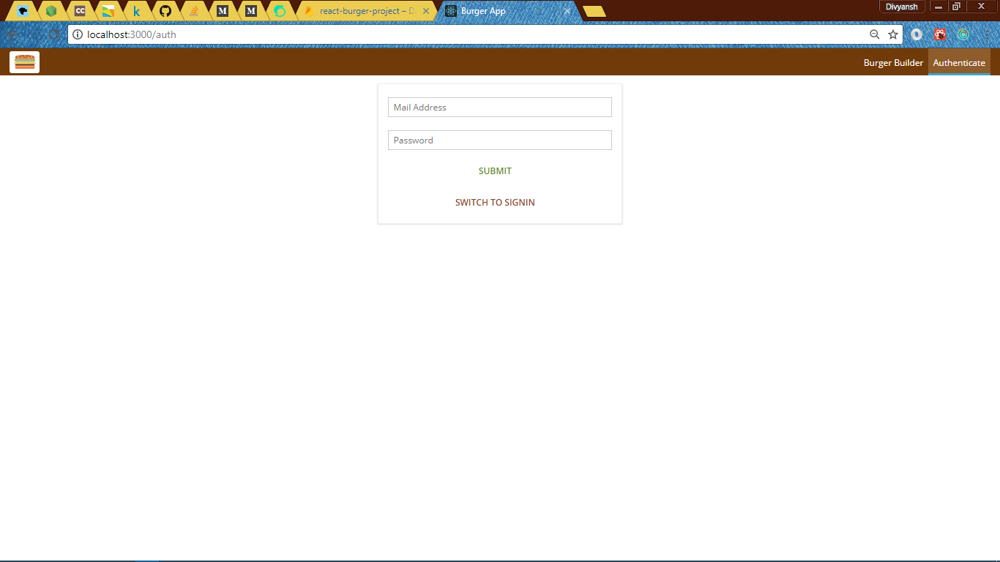
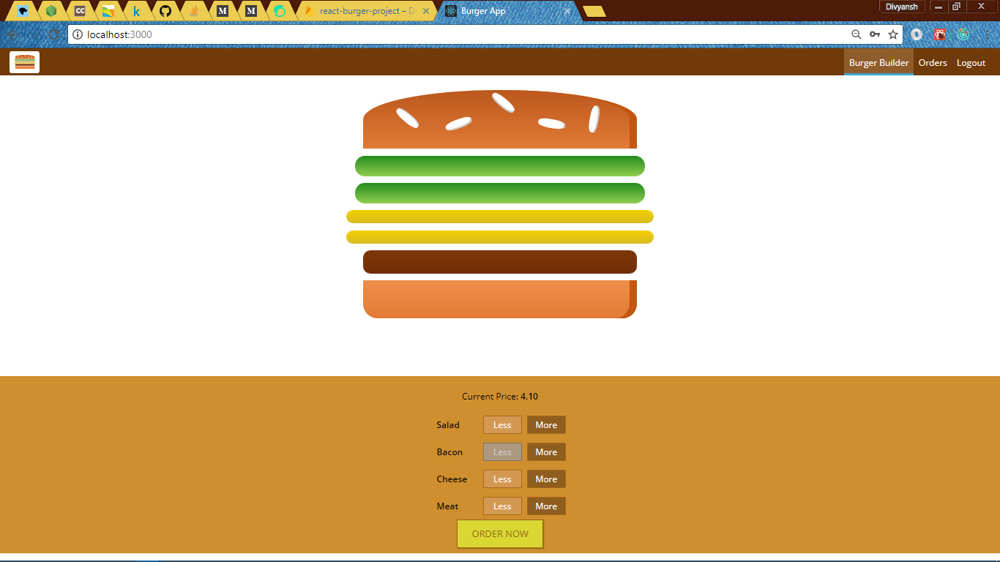
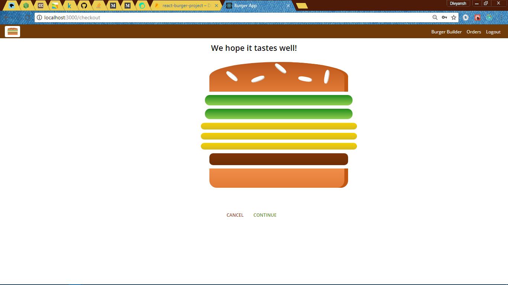

# React-Burger-Builder!!

A complex single page web app made in react for a burger outlet.

## Getting Started
```
* Clone the repo.
* run npm install
* run npm start
```

### Prerequisites

What things you need to install the software and how to install them

```
* NODEJS
* ReactJS
```

## Built With

* [NODEJS](https://www.nodejs.org) - The web framework used
* [ReactJS](https://www.reactjs.org) - Front End Framework.

## Contributing

Please contribute any ideas or code as to make this app a better one.


## Authors

* **Divyansh Dwivedi** - *Initial work*

See also the list of [contributors](https://github.com/your/project/contributors) who participated in this project.

## License

This project is currently unlicensed.

## Screenshot








